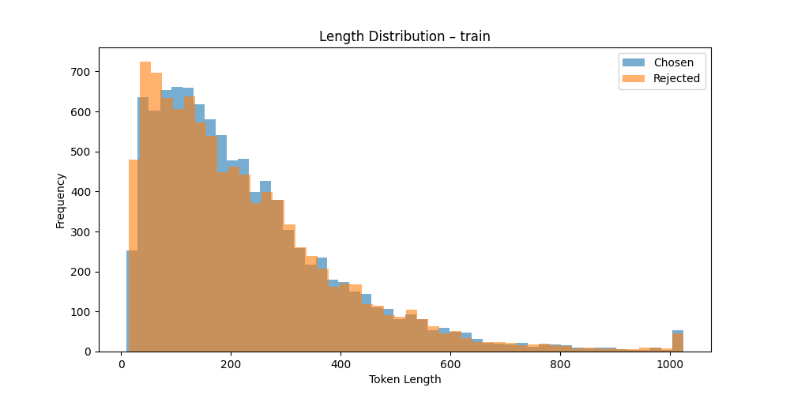
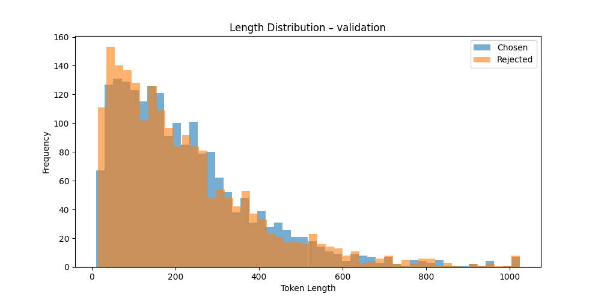
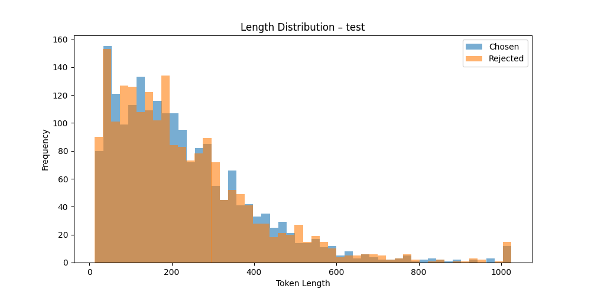
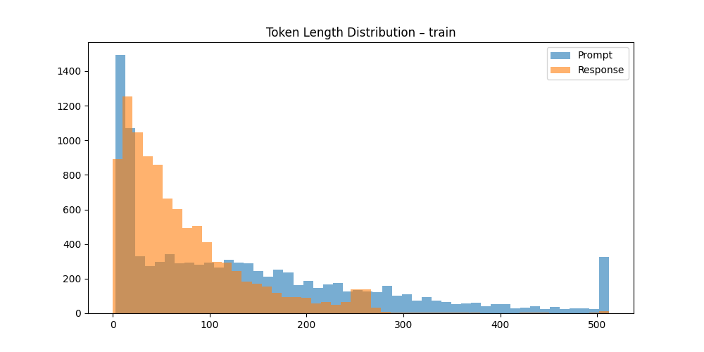
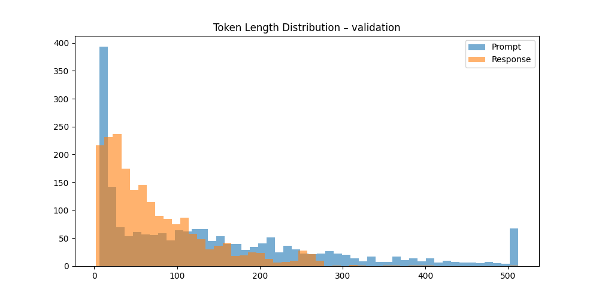

# LLM_RLHF

Codebase for IEMS 490 Homework 3.

### Data Processing:

#### Reward Model Training

Here’s an example of the data used for training the reward model:

```json
{
  "chosen": "\n\nHuman: Should you rent a Uhaul to move?\n\nAssistant: Do you need to transport very large, heavy items?\n\nHuman: Yes like couches and beds.\n\nAssistant: I would probably recommend a Uhaul.\n\nHuman: Can anyone drive one of them?\n\nAssistant: Yes, you can rent a Uhaul and drive it yourself, you just need a valid license.",
  "rejected": "\n\nHuman: Should you rent a Uhaul to move?\n\nAssistant: Do you need to transport very large, heavy items?\n\nHuman: Yes like couches and beds.\n\nAssistant: I would probably recommend a Uhaul.\n\nHuman: Can anyone drive one of them?\n\nAssistant: The minimum age to drive a Uhaul is 18.  But you can ask the rental location if you’re 15 or 17."
}
```
#### Data Statistics and Histograms

##### Training Set
- Total pairs: 10,000  
- Chosen response lengths: mean = 227.17 | min = 10 | max = 1024  
- Rejected response lengths: mean = 223.72 | min = 14 | max = 1024  


##### Validation Set
- Total pairs: 2,000  
- Chosen response lengths: mean = 227.03 | min = 11 | max = 1024  
- Rejected response lengths: mean = 221.41 | min = 15 | max = 1024  


##### Test Set
- Total pairs: 2,000  
- Chosen response lengths: mean = 227.19 | min = 14 | max = 1024  
- Rejected response lengths: mean = 226.90 | min = 13 | max = 1024  



#### PPO, GRPO, DPO Optimization:

Here’s an example of the data used for RLHF model training:

```json
{
  "chosen": "\n\nHuman: Should you rent a Uhaul to move?\n\nAssistant: Do you need to transport very large, heavy items?\n\nHuman: Yes like couches and beds.\n\nAssistant: I would probably recommend a Uhaul.\n\nHuman: Can anyone drive one of them?\n\nAssistant: Yes, you can rent a Uhaul and drive it yourself, you just need a valid license.",
  "rejected": "\n\nHuman: Should you rent a Uhaul to move?\n\nAssistant: Do you need to transport very large, heavy items?\n\nHuman: Yes like couches and beds.\n\nAssistant: I would probably recommend a Uhaul.\n\nHuman: Can anyone drive one of them?\n\nAssistant: The minimum age to drive a Uhaul is 18.  But you can ask the rental location if you’re 15 or 17."
}
```
#### Data Statistics and Histograms

##### Training Set
* Prompt length – mean:141.70  min:3  max:512
* Response length – mean:73.13  min:0  max:512


##### Validation Set 
* Prompt length – mean:141.83  min:6  max:512
* Response length – mean:72.66  min:2  max:512 


##### Test Set
* Prompt length – mean:143.35  min:3  max:512
* Response length – mean:72.75  min:0  max:512


### Final Results:

- Failure Analysis of Reward model training can be found in `evaluations/reward_failure_analysis.ipynb`
- Overall PPO/GRPO/DPO experiment analysis can be found in  `evaluations/analysis.ipynb`
